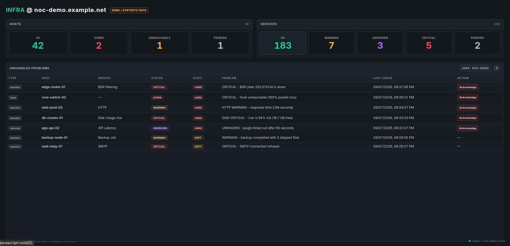
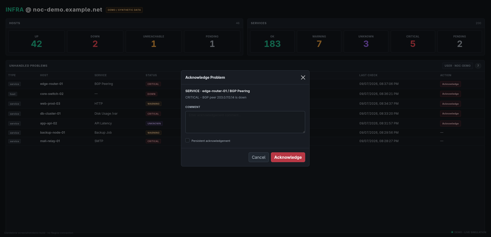

# Nagios NOC Status

A lightweight web dashboard for displaying Nagios host/service status and acknowledging active problems.

## Features

- Nagios host and service status dashboard
- Host/service problem filtering
- Basic Authentication through Apache or Nginx
- Nagios acknowledgement through the external command interface
- Optional persistent acknowledgement comments
- Uses the authenticated web user as the Nagios acknowledgement author

## Screenshots

### NOC Status Dashboard



### Acknowledge Problem



## Requirements

- Nagios Core
- Apache or Nginx
- PHP with PHP-FPM when using Nginx
- Access to the Nagios status file
- Permission to write to the Nagios external command file
- An htpasswd file containing the users allowed to access the dashboard

## Repository layout

```text
nagios-noc-status/
├── api/
│   └── noc-ack/
│       └── index.php
├── config/
│   ├── apache/
│   │   └── nagios-noc-status.conf.example
│   └── nginx/
│       └── nagios-noc-status.conf.example
├── docs/
│   └── INSTALL.md
├── index.html
├── LICENSE
├── README.md
└── .gitignore
```

## Configuration

Nagios-specific paths should not be hard-coded throughout the application.

The recommended approach is to provide a single application configuration file, for example:

```text
config/config.php
```

This configuration should contain environment-specific values such as:

- Nagios status file
- Nagios external command file
- Other local deployment settings

Example:

```php
<?php
declare(strict_types=1);
/*
 * Nagios status.dat file.
 */
define(
    'NAGIOS_STATUS_FILE',
    '/var/spool/nagios/status.dat'
);


/*
 * Nagios external command pipe.
 */
define(
    'NAGIOS_COMMAND_FILE',
    '/var/spool/nagios/cmd/nagios.cmd'
);
?>
```

Do **not** commit production-specific secrets or credentials to Git. If the configuration contains sensitive or environment-specific information, keep the real file outside the repository or provide a `.example` file instead.

> The current source files may still contain the legacy Nagios paths. Before production deployment, centralize these values in the application configuration and update the scripts to load that configuration.

## Web server configuration

Example configurations are provided for:

- Apache: `config/apache/nagios-noc-status.conf.example`
- Nginx: `config/nginx/nagios-noc-status.conf.example`

Both examples use the Nagios htpasswd file for HTTP Basic Authentication.

Adjust the following for your environment:

- `ServerName`
- document root
- PHP-FPM socket when using Nginx
- Nagios htpasswd file location
- TLS/HTTPS configuration

See [INSTALL.md](docs/INSTALL.md) for the complete setup procedure.

## Security

The dashboard should be served over HTTPS in production.

The Nagios command file must not be located inside the web document root.

The web server user needs the minimum permissions required to access the Nagios status information and submit external commands.

## Acknowledgements

The dashboard supports non-persistent and persistent acknowledgement comments.

By default, an acknowledgement is submitted as non-persistent. The user can explicitly select **Persistent acknowledgement** in the acknowledgement dialog when required.

## License

See [LICENSE](LICENSE).
